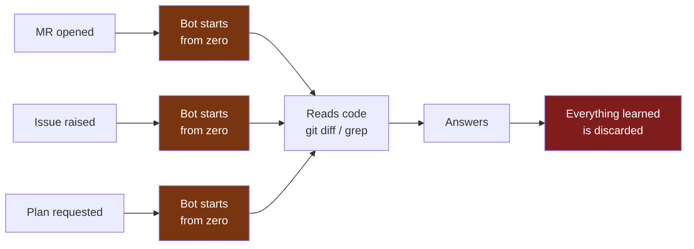
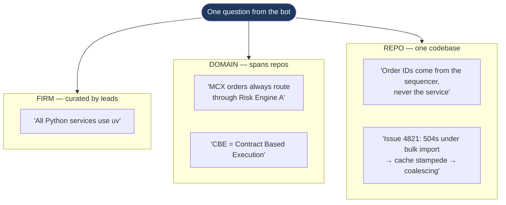
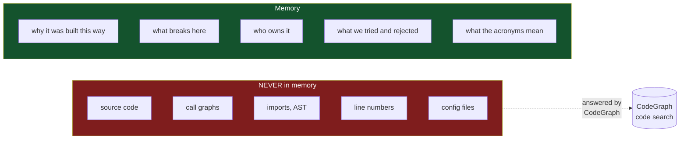
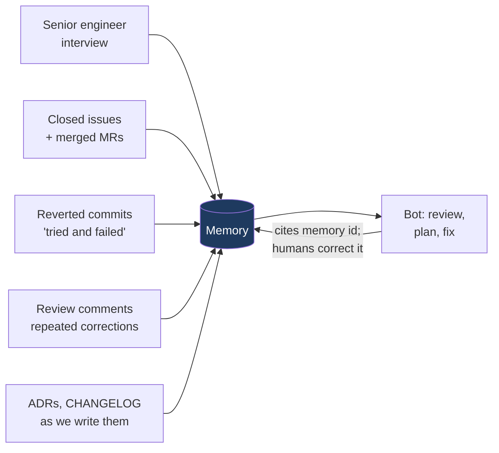

# firm-mem0 — What It Is, In One Page

**A memory layer that lets our OpenCode bot remember how this firm builds
software, so it stops relearning the same things on every single call.**

---

## The problem today

Every bot invocation is independent. It can read the code — but the code does
not record *why* it is that way, what has already been tried and rejected, which module breaks in production, or that MCX orders must route through margin checks in OMS. That knowledge lives in a few senior engineers' heads, and we pay for it every time by re-explaining it.

---

## What mem0 gives us, and what it does not

**mem0** is an open-source memory layer for AI applications: it extracts durable
facts from interactions, stores them as vectors, and retrieves the relevant few
on demand. 

Its defaults, however, are built for consumer assistants — one user, one
assistant, personal preferences. Our work is repo-centric and firm-wide, and
spans many codebases. Left unadapted, every application would invent its own
keys and the memory pool becomes unqueryable within a quarter.

**firm-mem0 is the thin contract layer that fixes this.** Four decisions:

| #   | Decision                                                                                                                    | Why it matters                                                                                                                           |
| --- | --------------------------------------------------------------------------------------------------------------------------- | ---------------------------------------------------------------------------------------------------------------------------------------- |
| 1   | **One namespace contract** — every write is scoped by repo and task, enforced in code                                       | An unscoped write is *not expressible*.                                                                                                  |
| 2   | **An engineering taxonomy** — business rules, architecture decisions, review patterns, ownership, terminology, build quirks | mem0's stock extraction is tuned for food and hobbies. Ours is tuned for trading systems.                                                |
| 3   | **Three memory layers** — repo, domain, firm. **No per-engineer and no per-team layer.**                                    | Knowledge that spans Gateway → Risk → Execution → DropCopy is not owned by any one repo — and none of it is owned by a person or a team. |
| 4   | **Strict boundaries on what is stored**                                                                                     | Memory holds judgements, never code. Code drifts; judgements do not.                                                                     |

---

## The three layers

All three are searched in **a single database call**, ranked together. Retrieval
costs ~200ms.

### Every layer is owned by the code or the firm — never by a person or a team

There is deliberately no per-engineer layer and no per-team layer. Two reasons:

- **The bot is stateless and serves everyone identically.** No answer should
depend on who opened the MR. A per-engineer pool makes the same question
return different answers to different people — a correctness problem dressed
up as personalisation.
- **We have no team-to-use-case segregation.** No team owns a domain, a repo
set, or a class of work. A team axis would split the pool along a line that
does not exist in the organisation, turning one fact into several copies that
drift apart and that no single query can reach.

The trade-off, stated plainly: individual reviewer preferences are out of scope.
A preference only enters memory once it is agreed and curated as a firm
convention — which is the version worth having anyway.

---

## What goes in — and what never does

**This is the single most important rule.** Anything CodeGraph can answer is
dynamic and would go stale in memory within a sprint. Memory holds only what is
*expensive for a human to keep re-explaining* — which is exactly what never gets
written down anywhere.

**The codebase always wins.** Memory is a hypothesis about the code; where they
disagree, the code is right and the memory is flagged. This rule is in the bot's
system prompt.

---

## Where the knowledge comes from

Every memory carries the MR, issue, or person it came from. When the bot uses
one, it **cites the id** — so any engineer can check it, and correct it with a
comment. Memory is a team artifact, not a black box.

---

## Current status

The namespace layer **already exists and is tested**.

What remains is connecting it to the bot. That is the delivery plan.

---

## Impact

|                              | Today                                           | With memory                                                                                    |
| ---------------------------- | ----------------------------------------------- | ---------------------------------------------------------------------------------------------- |
| **Repeat review iterations** | Full diff + every past comment resent each time | Only what changed since the last review — and no re-raising points the author already answered |
| **On-call**                  | Re-derive a fix that may already exist          | *"This looks like #4821"* — with the prior root cause and fix, before exploring                |
| **Tribal knowledge**         | Lives in a few heads; lost when they move teams | Captured once into one firm-wide pool — no per-team or per-person copies to drift apart        |
| **AI-authored code**         | Matches the code's current shape                | Matches how this firm actually builds — conventions, rejected designs, migrations in flight    |
| **New joiners**              | Weeks of asking the same questions              | The bot answers *"why is it like this?"* from day one                                          |

**The strategic point:** CodeGraph makes the bot fast at reading our code. This
makes it *knowledgeable about our firm* — and unlike the code index, it
compounds. Every review, every resolved incident, every correction an engineer
makes leaves the system permanently better. That asset is ours, it stays on our
infrastructure, and no vendor can take it away.