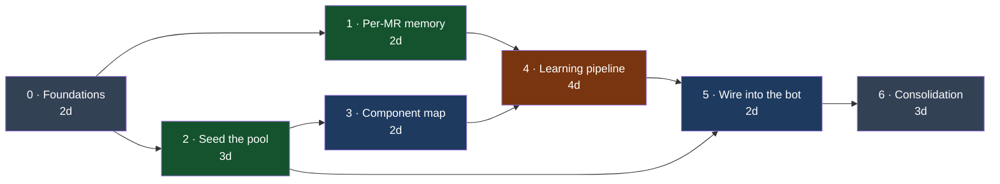
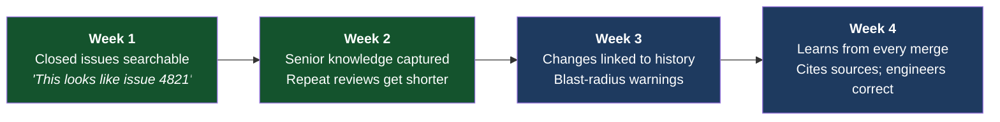
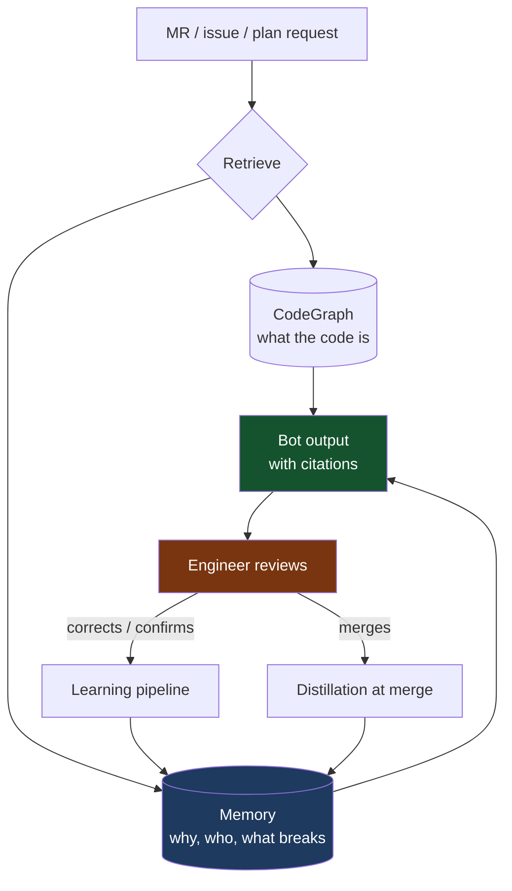

# Delivery Plan — Memory for the OpenCode Bot

**~16–18 engineering days, one pilot repo, seven phases. Value is visible from
week one, not at the end.**

---

## The shape of the plan

Green = fastest visible value. Amber = highest complexity.

---

## What each phase delivers

| Phase                     | Delivers                                                                                               | Days | Risk     |
| ------------------------- | ------------------------------------------------------------------------------------------------------ | ---- | -------- |
| **0 · Foundations**       | Extend the existing library: cross-repo layer, filters, safety controls, secret scrubbing              | 2    | Low      |
| **1 · Per-MR memory**     | Repeat reviews read a short history instead of resending everything                                    | 2    | Low      |
| **2 · Seed the pool**     | **2a** existing docs · **2b** every closed issue becomes searchable · **2c** senior-engineer interview | 3    | Low      |
| **3 · Component map**     | Link a code change to the memories about that part of the system                                       | 2    | Medium   |
| **4 · Learning pipeline** | Bot learns from merged work and human corrections; starts proposing ADRs                               | 4    | **High** |
| **5 · Wire into the bot** | Memory reaches every review and plan; bot cites what it used                                           | 2    | Medium   |
| **6 · Consolidation**     | Keeps retrieval sharp as the pool grows for years                                                      | 3    | Medium   |

---

## Value arrives early

**Phase 2b is the proof point.** Backfilling closed issues takes about a day and
can be demonstrated immediately against issues the team remembers — before any
judgement-dependent machinery is built. If recall quality is poor there, we
learn it cheaply and stop.

---

## Two loops, once it is running

The bot gets better because engineers use it — not because we keep tuning it.

---

## Controls, by design

| Concern                                                       | Control                                                                                             |
| ------------------------------------------------------------- | --------------------------------------------------------------------------------------------------- |
| **A bad memory spreading**                                    | Nothing becomes an enforced rule without human approval. Firm-wide memory is lead-curated only.     |
| **Malicious or careless text becoming a durable instruction** | Bot treats MR and issue text as *data, never instructions*, plus a validator and an approval ladder |
| **Secrets leaking into the pool**                             | Automated scrubbing at the write boundary, before anything is stored                                |
| **Stale knowledge misleading the bot**                        | The code always wins; memories are cited so engineers spot and correct them                         |
| **The pool degrading over time**                              | Monthly consolidation; nothing is ever silently deleted; tracked on a dashboard                     |
| **Data leaving the firm**                                     | Self-hosted , local reranking                                                                       |

---

## What we need from leadership

| Ask                                                               | Size          | Blocks                                                                                                    |
| ----------------------------------------------------------------- | ------------- | --------------------------------------------------------------------------------------------------------- |
| **Input from senior engineers** for the knowledge-capture session | lead/repo     | **Critical path.** Without it the pool has no authoritative content and nothing downstream can be judged. |
| **One pilot repo** with active MRs and real issue history         | naming a repo | Everything                                                                                                |
| **A named owner for the ADR review queue**                        | ~30 min/week  | Phase 4's ADR output                                                                                      |
| **Sign-off on one firm-wide memory pool**                         | a decision    | Phase 5 — anyone who can query memory reaches knowledge distilled from every repo                         |

---

## How we will know it worked

| Metric                                              | Target                                    |
| --------------------------------------------------- | ----------------------------------------- |
| Bot outputs citing at least one memory              | rising, then steady                       |
| Cited memories the engineer accepted                | rising                                    |
| Review comments the team already rejected, repeated | **falling**                               |
| Tokens per repeat review iteration                  | **falling**                               |
| Pool size ÷ usefulness                              | flat — the early-warning signal for decay |

We measure **whether memory gets used and trusted**, not how much of it we
accumulate.

---

## Impact

**Immediate (weeks 1–4)**

- On-call stops re-solving solved problems — prior root cause and fix surface before investigation starts
- Repeat reviews cost a fraction of the tokens and stop re-raising settled points
- The knowledge in senior engineers' heads becomes available to everyone, on every MR

**Compounding (months 2+)**

- Every merged MR, resolved incident, and review correction leaves the system permanently better — with no extra effort from anyone
- Migrations and deprecations become enforceable firm-wide in every review, which is not practical today
- New joiners get *"why is it like this?"* answered from day one instead of after a quarter

**Strategic**

- AI-authored code converges on **how this firm actually builds** — its conventions, its rejected designs, its production history — rather than on generic best practice
- The asset is ours: self-hosted, no vendor lock-in, and it grows more valuable the longer it runs

**The cost to find out is small.** Phase 0–2 is roughly one engineer-week and it produces a demonstrable result we can test against issues the team already remembers. Everything after that is a decision we make with evidence rather than in advance.