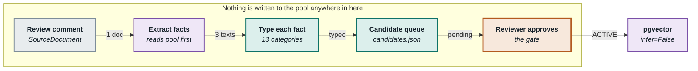
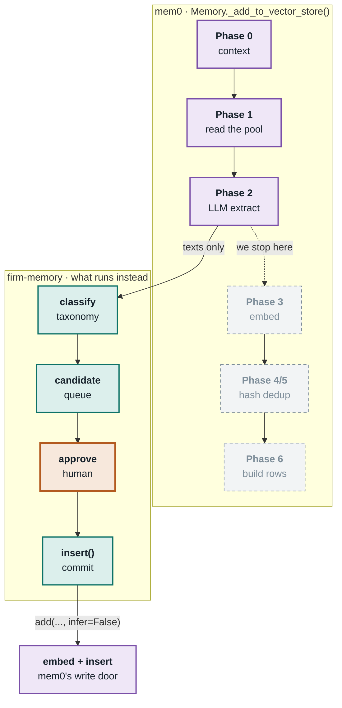
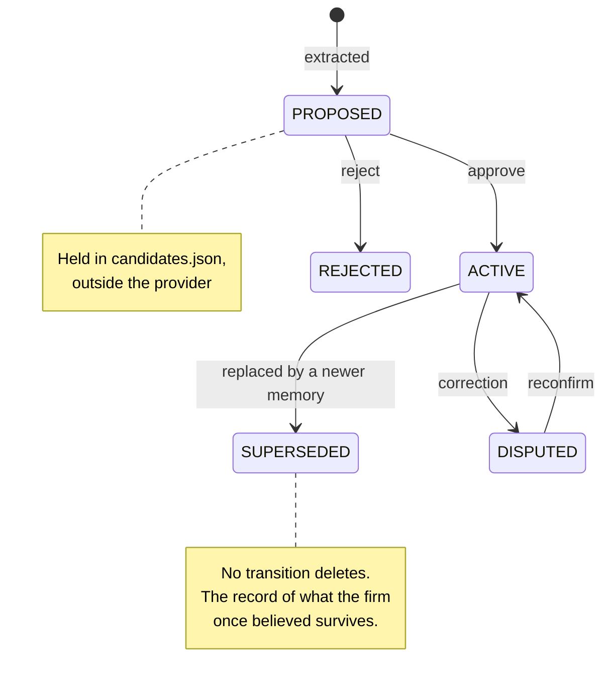

# From Review Comment to Memory

One PR review comment, three extracted facts, one human decision. Traced end to
end — with the line drawn between what mem0 does and what the firm owns.

> **Colour key for every diagram below**
> 🟣 **mem0** does the work · 🟢 **firm-memory** does the work · 🟠 a **person** decides

---

## 01 · The map

A review comment enters as one `SourceDocument`. mem0's extractor reads it —
alongside the memories already in the pool — and returns candidate facts. Those
are typed against the firm taxonomy, queued, and go nowhere until a person
approves them.



**The gate is not a convention or a code-review rule — it is the only path that
reaches pgvector.** Extraction has no write available to it. An unapproved run
leaves the database exactly as it was.

---

## 02 · Where mem0's `add()` was cut in half

mem0's value on the ingestion side is its extractor: one LLM call that reads the
input *together with the memories already stored* and returns only what is
genuinely new. Reproducing that deduplication by hand is the hard part, so it is
reused rather than replaced.

But `Memory.add()` extracts **and writes** in a single call. Its seven phases
split cleanly: the first three only read, and the rest embed and persist. The
extractor runs the read-only half and stops.



Phases 3–6 are **skipped entirely** — nothing embedded, nothing persisted.

Approved memory then re-enters mem0 through a *different door*:
`add(..., infer=False)` embeds and stores the fact verbatim. It is already
distilled and already approved, and re-extracting it would summarise a summary
and discard the provenance the gate just attached.

---

## 03 · Two model calls, in order

Extraction costs one round trip; classification costs a second, batched across
every fact rather than one per fact. mem0's output schema is
`{"memory": [{"text": ...}]}` with no category field, and a dozen few-shot
examples anchor it — so custom instructions cannot reliably add one.

```python
# 1. dedup context — a scoped read of the pool, so extraction sees what already exists
existing = provider.extraction_context(scope, comment, limit=10)

# 2. mem0's own extractor, its own prompt, its own LLM — but no write
response = backend.llm.generate_response(
    messages=[
        {"role": "system", "content": ADDITIVE_EXTRACTION_PROMPT},
        {"role": "user",   "content": generate_additive_extraction_prompt(
            existing_memories=existing,
            new_messages=[{"role": "user", "content": comment}],
            custom_instructions=fact_extraction_instructions(),   # the firm taxonomy
        )},
    ],
    response_format={"type": "json_object"},
)                                # -> {"memory": [{"text": ...}, ...]}

# 3. ours: one batched call assigns a type and a confidence to every fact
classified = classify(texts)     # -> [{index, type, confidence}, ...]
```

### Why the taxonomy is the guard

mem0's extraction prompt is written for a consumer assistant — its own worked
examples are *"User has a dog named Max"* and *"User was promoted at Shopify"*.
The firm's instructions steer it, but those examples still pull toward
personal-profile facts.

So the classifier is given an explicit `none` category. A fact about an
individual's preferences fits nothing in the taxonomy, is typed `none`, and is
dropped before a reviewer ever sees it.

---

## 04 · What one comment actually produced

A single review comment about order routing yielded three facts of three
different types — a rule, a rejected approach, and a design decision — each
self-contained enough to be useful months later to someone who never read the
thread.

| Type | Confidence | Fact |
| --- | --- | --- |
| `architecture_decisions` | 0.95 | OrderRouter is the single point through which all venue paths flow; order suppression must occur in OrderRouter, not in strategy code, because DropCopy reconciles emitted orders against actual exchange activity and strategy-level suppression creates gaps between what the system thinks it sent and what the exchange received. |
| `anti_patterns` | 0.92 | Queueing after-cut-off orders for the next session was attempted in March 2026 but caused duplicate fills and was reverted the same week; MCX rejects cash strategy orders sent after 15:20, so queueing only defers the rejection rather than preventing it. |
| `business_rules` | 0.98 | MCX rejects any order for cash strategies sent after 15:20 (cut-off time); this is a hard venue constraint that cannot be worked around by queueing. |

All three entered the queue as `PROPOSED`. None was in the database.

---

## 05 · How a candidate is held

Candidates wait **outside** the provider, in a JSON file written atomically.
That matters for a stateless bot: the agent that proposes during a review and
the engineer who approves hours later are different processes. It also means a
failure at the write step does not discard work a reviewer has already done.

Ids are content-addressed — `blake2b(content + scope + type)` — so a bot
re-running the same merge request updates one entry instead of burying the
reviewer in duplicates.



Approval and rejection are the only exits from the queue. After that, no
transition deletes: supersession names the replacement and a correction demotes
and flags.

---

## 06 · Who owns what

The split is deliberate and load-bearing: mem0 owns *how memory is stored and
retrieved*, firm-memory owns *what a firm memory means*. That is what lets a
second provider be introduced later without changing a single consumer.

### mem0 provides

- The extraction prompt and its deduplication against stored memories
- The LLM client — litellm, so one OpenRouter key reaches any model
- Embeddings, via fastembed running locally over ONNX
- The pgvector store, its schema and its indexes
- Hybrid retrieval: dense vectors, Postgres full-text, entity boosts

### firm-memory provides

- The taxonomy — 13 types with the exclusions that keep code and secrets out
- Scope: firm, domains and repos as independent attributes
- The canonical memory model, which makes provider migration possible
- The decision to stop after phase 2, and the approval gate that follows
- Provenance, lifecycle status, and the tier filters that keep scratch state out of recall

### Step by step

| Step in the run | Owner | What actually happens |
| --- | --- | --- |
| Read the pool for context | **mem0** | Scoped vector search, top 10, shown to the extractor as deduplication context |
| Extract candidate facts | **mem0** | `ADDITIVE_EXTRACTION_PROMPT` plus the firm taxonomy as custom instructions |
| Assign a type | **firm-memory** | One batched call; anything typed `none` is discarded |
| Hold for review | **firm-memory** | Content-addressed id, written atomically to `candidates.json` |
| Approve | **firm-memory** | Status becomes `ACTIVE`; the approver is recorded in provenance |
| Embed and store | **mem0** | `add(..., infer=False)` — fastembed, then insert into pgvector |
| Retrieve later | **mem0** | Hybrid search, filtered by the scope atoms and tier that firm-memory supplies |

---

*firm-memory · `examples/review_comment.py` · mem0ai 2.0.20 ·
`openrouter/anthropic/claude-haiku-4.5` · `BAAI/bge-small-en-v1.5` · pgvector*
